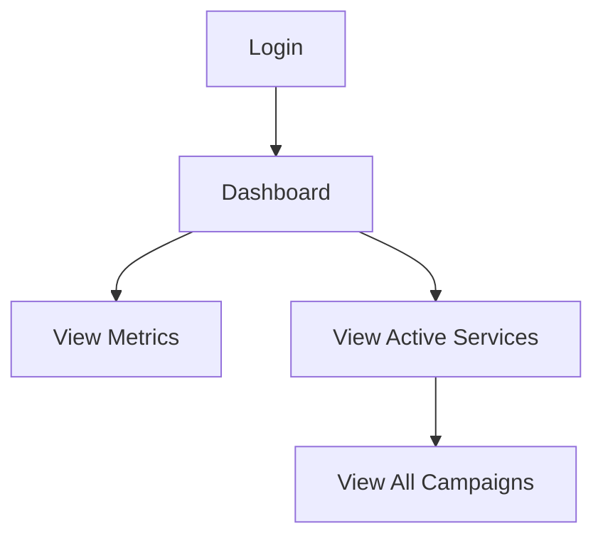

## 1. Product Overview
Client dashboard for marketing performance overview and campaign insights. Provides real-time metrics tracking and active campaign management for marketing clients.

## 2. Core Features

### 2.1 User Roles
| Role | Registration Method | Core Permissions |
|------|---------------------|------------------|
| Client | Email registration | View dashboard metrics, manage campaigns |

### 2.2 Feature Module
The client dashboard consists of the following main pages:
1. **Dashboard**: Header with welcome message, metric cards (2x2 grid), active services section

### 2.3 Page Details
| Page Name | Module Name | Feature description |
|-----------|-------------|---------------------|
| Dashboard | Header | Display "Client Dashboard" title (serif/italic, dark gray) and "Welcome, Jane Smith" (sans-serif, gray, top-right) |
| Dashboard | Gradient Banner | Pink→magenta→purple gradient background with "Welcome back, Jane Smith!" heading and marketing overview subtext (white text) |
| Dashboard | Metric Cards Row 1 | Two dark navy cards: Website Traffic (12.4K, +15.2%), Lead Generation (284, +8.7%) with bar-chart icons |
| Dashboard | Metric Cards Row 2 | Two dark navy cards: Conversion Rate (3.2%, -2.1%), ROI (4.2x, +25.8%) with bar-chart icons |
| Dashboard | Active Services | Dark navy container with "Active Services" header, "View All" button with arrow, campaign items with status indicators |
| Dashboard | Campaign Items | Instagram Marketing with green status dot, pink "instagram" pill badge, "active" status badge |
| Dashboard | Floating Button | Black circular button with "N" letter in bottom-left corner |

## 3. Core Process

## 4. User Interface Design
### 4.1 Design Style
- **Colors**: White background, dark navy cards (#1a1a2e), gradient banner (pink→magenta→purple), white text, gray secondary text, green positive metrics, red negative metrics
- **Typography**: Sans-serif for UI elements, serif/italic for "Client Dashboard" and campaign names
- **Card Style**: Dark navy rounded rectangles with small bar-chart icons in top-right
- **Button Style**: Rounded pills for badges, "View All" with arrow indicator
- **Layout**: 2x2 metric card grid, full-width Active Services section

### 4.2 Page Design Overview
| Page Name | Module Name | UI Elements |
|-----------|-------------|-------------|
| Dashboard | Header | Serif/italic "Client Dashboard", sans-serif "Welcome, Jane Smith" aligned right |
| Dashboard | Gradient Banner | Left-to-right gradient (pink→magenta→purple), rounded rectangle, white heading and subtext |
| Dashboard | Metric Cards | Dark navy background, white values, gray titles, green/red percentage changes, bar-chart icons |
| Dashboard | Active Services | Dark navy container, white "View All" button with arrow, campaign sub-cards |
| Dashboard | Campaign Items | Green status dot, italic script campaign names, pink platform badges, gray status badges |

### 4.3 Responsiveness
Desktop-first design with mobile-adaptive layout. Metric cards should stack vertically on mobile devices.