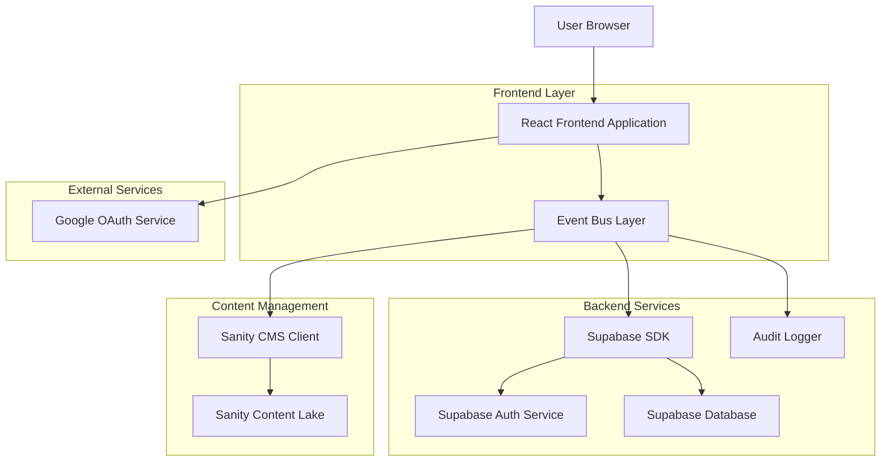
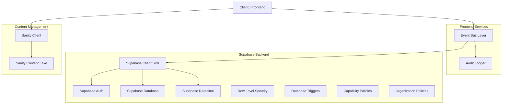
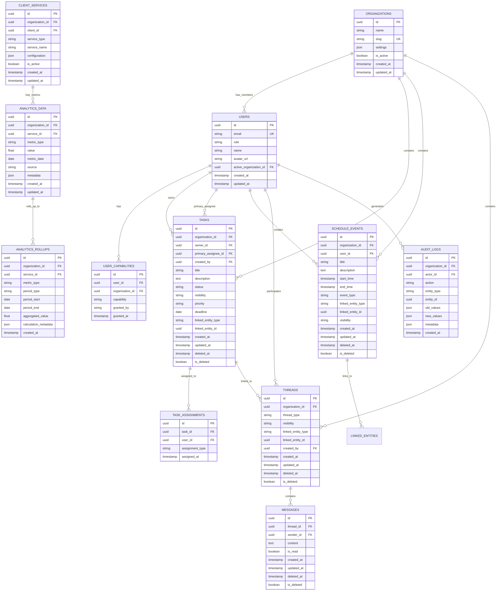

## 1. Architecture Design



## 2. Technology Description
- **Frontend**: React@18 + tailwindcss@3 + vite
- **Initialization Tool**: vite-init
- **Backend**: Supabase (PostgreSQL, Auth, Real-time, Row Level Security)
- **Content Management**: Sanity CMS with capability-based content delivery
- **Authentication**: Google OAuth with organization allowlist
- **State Management**: React Context + Event Bus + Supabase Real-time
- **UI Components**: Custom components with Tailwind CSS
- **Charts**: Recharts for data visualization
- **Date Management**: date-fns
- **Event Bus**: Custom command dispatcher with optimistic updates

## 3. Route Definitions

### Employee Routes
| Route | Purpose |
|-------|---------|
| /login | Google OAuth authentication with organization selection |
| /employee/dashboard | Main employee dashboard with capability-gated widgets |
| /employee/tasks | Task management with ownership and visibility controls |
| /employee/schedule | Calendar with event types and entity linking |
| /employee/chats | Threaded messaging with visibility controls |
| /employee/clients | Client management with organization scoping |
| /employee/team | Team directory with capability-based access |
| /employee/documents | File sharing with audit logging |
| /employee/finance | Financial reporting with capability gates |
| /employee/settings | Profile, organization, and capability management |

### Client Routes
| Route | Purpose |
|-------|---------|
| /login | Google OAuth authentication with organization allowlist |
| /client/dashboard | Marketing analytics with source attribution |
| /client/services | Service performance with organization isolation |
| /client/calendar | Campaign calendar with event type support |
| /client/support | Threaded support with ticket management |
| /client/settings | Profile and service configuration |

## 4. API Definitions

### 4.1 Authentication APIs
```
POST /api/auth/callback
GET /api/auth/organizations
POST /api/auth/organization/select
```

Organization selection and capability assignment:
| Param Name | Param Type | isRequired | Description |
|------------|------------|------------|-------------|
| organization_id | uuid | true | Selected organization ID |
| capabilities | string[] | false | Assigned capabilities for session |

### 4.2 Task Management APIs with Ownership
```
GET /api/tasks?visibility=private|team|client&organization_id=uuid
POST /api/tasks
PUT /api/tasks/:id
DELETE /api/tasks/:id
POST /api/tasks/:id/assign
POST /api/tasks/:id/transfer-ownership
```

Enhanced task request:
| Param Name | Param Type | isRequired | Description |
|------------|------------|------------|-------------|
| title | string | true | Task title |
| description | string | false | Task description |
| owner_id | uuid | true | Primary owner/accountable user |
| primary_assignee_id | uuid | false | Primary assignee |
| visibility | string | true | Task visibility (private/team/client) |
| organization_id | uuid | true | Organization scoping |
| linked_entity_type | string | false | Linked entity type (campaign, project, etc.) |
| linked_entity_id | uuid | false | Linked entity ID |

### 4.3 Schedule APIs with Event Types
```
GET /api/schedule/events?type=meeting|campaign|deadline|availability|content_drop
POST /api/schedule/events
PUT /api/schedule/events/:id
DELETE /api/schedule/events/:id
```

Event creation with linking:
| Param Name | Param Type | isRequired | Description |
|------------|------------|------------|-------------|
| title | string | true | Event title |
| event_type | string | true | Event type from ENUM |
| linked_entity_type | string | false | Linked entity type |
| linked_entity_id | uuid | false | Linked entity ID |
| visibility | string | true | Event visibility |
| organization_id | uuid | true | Organization scoping |

### 4.4 Threaded Messaging APIs
```
GET /api/threads?type=dm|task|support|client&visibility=internal|client
POST /api/threads
POST /api/threads/:thread_id/messages
PUT /api/messages/:id
DELETE /api/messages/:id
```

Thread creation:
| Param Name | Param Type | isRequired | Description |
|------------|------------|------------|-------------|
| thread_type | string | true | Thread type from ENUM |
| visibility | string | true | Thread visibility (internal/client) |
| linked_entity_type | string | false | Linked entity type (task, support_ticket) |
| linked_entity_id | uuid | false | Linked entity ID |
| organization_id | uuid | true | Organization scoping |

### 4.5 Analytics APIs with Source Attribution
```
GET /api/analytics/services?source=api|manual|estimated|imported
GET /api/analytics/services/:serviceId/rollups?period=daily|weekly|monthly
GET /api/analytics/performance?organization_id=uuid
POST /api/analytics/data
```

Analytics data ingestion:
| Param Name | Param Type | isRequired | Description |
|------------|------------|------------|-------------|
| service_id | uuid | true | Service ID |
| metric_type | string | true | Metric type identifier |
| value | float | true | Metric value |
| source | string | true | Data source type |
| metric_date | date | true | Metric date |
| metadata | json | false | Additional metadata |
| organization_id | uuid | true | Organization scoping |

### 4.6 Organization Management APIs
```
GET /api/organizations
POST /api/organizations
PUT /api/organizations/:id
GET /api/organizations/:id/members
POST /api/organizations/:id/members
PUT /api/organizations/:id/members/:user_id/role
```

## 5. Server Architecture Diagram



## 6. Data Model

### 6.1 Enhanced Database Schema


### 6.2 Data Definition Language

```sql
-- Organizations table
CREATE TABLE organizations (
    id UUID PRIMARY KEY DEFAULT gen_random_uuid(),
    name VARCHAR(255) NOT NULL,
    slug VARCHAR(255) UNIQUE NOT NULL,
    settings JSONB DEFAULT '{}',
    is_active BOOLEAN DEFAULT TRUE,
    created_at TIMESTAMP WITH TIME ZONE DEFAULT NOW(),
    updated_at TIMESTAMP WITH TIME ZONE DEFAULT NOW()
);

-- Users table with organization context
CREATE TABLE users (
    id UUID PRIMARY KEY DEFAULT gen_random_uuid(),
    email VARCHAR(255) UNIQUE NOT NULL,
    role VARCHAR(20) NOT NULL CHECK (role IN ('admin', 'manager', 'employee', 'client')),
    name VARCHAR(255) NOT NULL,
    avatar_url TEXT,
    active_organization_id UUID REFERENCES organizations(id),
    created_at TIMESTAMP WITH TIME ZONE DEFAULT NOW(),
    updated_at TIMESTAMP WITH TIME ZONE DEFAULT NOW()
);

-- User capabilities for granular permissions
CREATE TABLE user_capabilities (
    id UUID PRIMARY KEY DEFAULT gen_random_uuid(),
    user_id UUID REFERENCES users(id) ON DELETE CASCADE,
    organization_id UUID REFERENCES organizations(id) ON DELETE CASCADE,
    capability VARCHAR(100) NOT NULL,
    granted_by VARCHAR(255),
    granted_at TIMESTAMP WITH TIME ZONE DEFAULT NOW(),
    UNIQUE(user_id, organization_id, capability)
);

-- Enhanced tasks with ownership and visibility
CREATE TABLE tasks (
    id UUID PRIMARY KEY DEFAULT gen_random_uuid(),
    organization_id UUID REFERENCES organizations(id) ON DELETE CASCADE,
    owner_id UUID REFERENCES users(id),
    primary_assignee_id UUID REFERENCES users(id),
    created_by UUID REFERENCES users(id),
    title VARCHAR(255) NOT NULL,
    description TEXT,
    status VARCHAR(20) NOT NULL DEFAULT 'not_started' CHECK (status IN ('not_started', 'in_progress', 'completed')),
    visibility VARCHAR(20) DEFAULT 'team' CHECK (visibility IN ('private', 'team', 'client')),
    priority VARCHAR(10) CHECK (priority IN ('low', 'medium', 'high')),
    deadline DATE,
    linked_entity_type VARCHAR(50),
    linked_entity_id UUID,
    created_at TIMESTAMP WITH TIME ZONE DEFAULT NOW(),
    updated_at TIMESTAMP WITH TIME ZONE DEFAULT NOW(),
    deleted_at TIMESTAMP WITH TIME ZONE,
    is_deleted BOOLEAN DEFAULT FALSE
);

-- Task assignments with type
CREATE TABLE task_assignments (
    id UUID PRIMARY KEY DEFAULT gen_random_uuid(),
    task_id UUID REFERENCES tasks(id) ON DELETE CASCADE,
    user_id UUID REFERENCES users(id) ON DELETE CASCADE,
    assignment_type VARCHAR(20) DEFAULT 'contributor' CHECK (assignment_type IN ('owner', 'primary', 'contributor', 'reviewer')),
    assigned_at TIMESTAMP WITH TIME ZONE DEFAULT NOW(),
    UNIQUE(task_id, user_id, assignment_type)
);

-- Enhanced schedule events with types and linking
CREATE TABLE schedule_events (
    id UUID PRIMARY KEY DEFAULT gen_random_uuid(),
    organization_id UUID REFERENCES organizations(id) ON DELETE CASCADE,
    user_id UUID REFERENCES users(id) ON DELETE CASCADE,
    title VARCHAR(255) NOT NULL,
    description TEXT,
    start_time TIMESTAMP WITH TIME ZONE NOT NULL,
    end_time TIMESTAMP WITH TIME ZONE,
    event_type VARCHAR(50) NOT NULL CHECK (event_type IN ('meeting', 'campaign', 'deadline', 'availability', 'content_drop')),
    linked_entity_type VARCHAR(50),
    linked_entity_id UUID,
    visibility VARCHAR(20) DEFAULT 'team' CHECK (visibility IN ('private', 'team', 'client')),
    created_at TIMESTAMP WITH TIME ZONE DEFAULT NOW(),
    updated_at TIMESTAMP WITH TIME ZONE DEFAULT NOW(),
    deleted_at TIMESTAMP WITH TIME ZONE,
    is_deleted BOOLEAN DEFAULT FALSE
);

-- Threaded messaging system
CREATE TABLE threads (
    id UUID PRIMARY KEY DEFAULT gen_random_uuid(),
    organization_id UUID REFERENCES organizations(id) ON DELETE CASCADE,
    thread_type VARCHAR(20) NOT NULL CHECK (thread_type IN ('dm', 'task', 'support', 'client')),
    visibility VARCHAR(20) DEFAULT 'internal' CHECK (visibility IN ('internal', 'client')),
    linked_entity_type VARCHAR(50),
    linked_entity_id UUID,
    created_by UUID REFERENCES users(id),
    created_at TIMESTAMP WITH TIME ZONE DEFAULT NOW(),
    updated_at TIMESTAMP WITH TIME ZONE DEFAULT NOW(),
    deleted_at TIMESTAMP WITH TIME ZONE,
    is_deleted BOOLEAN DEFAULT FALSE
);

CREATE TABLE messages (
    id UUID PRIMARY KEY DEFAULT gen_random_uuid(),
    thread_id UUID REFERENCES threads(id) ON DELETE CASCADE,
    sender_id UUID REFERENCES users(id) ON DELETE CASCADE,
    content TEXT NOT NULL,
    is_read BOOLEAN DEFAULT FALSE,
    created_at TIMESTAMP WITH TIME ZONE DEFAULT NOW(),
    updated_at TIMESTAMP WITH TIME ZONE DEFAULT NOW(),
    deleted_at TIMESTAMP WITH TIME ZONE,
    is_deleted BOOLEAN DEFAULT FALSE
);

-- Audit logging for compliance
CREATE TABLE audit_logs (
    id UUID PRIMARY KEY DEFAULT gen_random_uuid(),
    organization_id UUID REFERENCES organizations(id) ON DELETE CASCADE,
    actor_id UUID REFERENCES users(id),
    action VARCHAR(100) NOT NULL,
    entity_type VARCHAR(50) NOT NULL,
    entity_id UUID,
    old_values JSONB,
    new_values JSONB,
    metadata JSONB,
    created_at TIMESTAMP WITH TIME ZONE DEFAULT NOW()
);

-- Enhanced analytics with source attribution
CREATE TABLE analytics_data (
    id UUID PRIMARY KEY DEFAULT gen_random_uuid(),
    organization_id UUID REFERENCES organizations(id) ON DELETE CASCADE,
    service_id UUID REFERENCES client_services(id) ON DELETE CASCADE,
    metric_type VARCHAR(50) NOT NULL,
    value DECIMAL(15,2) NOT NULL,
    metric_date DATE NOT NULL,
    source VARCHAR(20) DEFAULT 'manual' CHECK (source IN ('api', 'manual', 'estimated', 'imported')),
    metadata JSONB,
    created_at TIMESTAMP WITH TIME ZONE DEFAULT NOW(),
    updated_at TIMESTAMP WITH TIME ZONE DEFAULT NOW()
);

-- Analytics rollups for performance
CREATE TABLE analytics_rollups (
    id UUID PRIMARY KEY DEFAULT gen_random_uuid(),
    organization_id UUID REFERENCES organizations(id) ON DELETE CASCADE,
    service_id UUID REFERENCES client_services(id) ON DELETE CASCADE,
    metric_type VARCHAR(50) NOT NULL,
    period_type VARCHAR(20) NOT NULL CHECK (period_type IN ('daily', 'weekly', 'monthly')),
    period_start DATE NOT NULL,
    period_end DATE NOT NULL,
    aggregated_value DECIMAL(15,2) NOT NULL,
    calculation_metadata JSONB,
    created_at TIMESTAMP WITH TIME ZONE DEFAULT NOW(),
    UNIQUE(organization_id, service_id, metric_type, period_type, period_start)
);

-- Client services with organization scoping
CREATE TABLE client_services (
    id UUID PRIMARY KEY DEFAULT gen_random_uuid(),
    organization_id UUID REFERENCES organizations(id) ON DELETE CASCADE,
    client_id UUID REFERENCES users(id) ON DELETE CASCADE,
    service_type VARCHAR(50) NOT NULL,
    service_name VARCHAR(255) NOT NULL,
    configuration JSONB DEFAULT '{}',
    is_active BOOLEAN DEFAULT TRUE,
    created_at TIMESTAMP WITH TIME ZONE DEFAULT NOW(),
    updated_at TIMESTAMP WITH TIME ZONE DEFAULT NOW()
);

-- Indexes for performance
CREATE INDEX idx_organizations_slug ON organizations(slug);
CREATE INDEX idx_users_email ON users(email);
CREATE INDEX idx_users_role ON users(role);
CREATE INDEX idx_users_organization ON users(active_organization_id);
CREATE INDEX idx_user_capabilities_user_org ON user_capabilities(user_id, organization_id);
CREATE INDEX idx_user_capabilities_capability ON user_capabilities(capability);
CREATE INDEX idx_tasks_organization ON tasks(organization_id);
CREATE INDEX idx_tasks_owner ON tasks(owner_id);
CREATE INDEX idx_tasks_primary_assignee ON tasks(primary_assignee_id);
CREATE INDEX idx_tasks_status ON tasks(status);
CREATE INDEX idx_tasks_visibility ON tasks(visibility);
CREATE INDEX idx_tasks_deadline ON tasks(deadline);
CREATE INDEX idx_tasks_deleted ON tasks(is_deleted, deleted_at);
CREATE INDEX idx_task_assignments_user ON task_assignments(user_id);
CREATE INDEX idx_task_assignments_task ON task_assignments(task_id);
CREATE INDEX idx_schedule_events_organization ON schedule_events(organization_id);
CREATE INDEX idx_schedule_events_user ON schedule_events(user_id);
CREATE INDEX idx_schedule_events_type ON schedule_events(event_type);
CREATE INDEX idx_schedule_events_start_time ON schedule_events(start_time);
CREATE INDEX idx_schedule_events_deleted ON schedule_events(is_deleted, deleted_at);
CREATE INDEX idx_threads_organization ON threads(organization_id);
CREATE INDEX idx_threads_type ON threads(thread_type);
CREATE INDEX idx_threads_visibility ON threads(visibility);
CREATE INDEX idx_threads_deleted ON threads(is_deleted, deleted_at);
CREATE INDEX idx_messages_thread ON messages(thread_id);
CREATE INDEX idx_messages_sender ON messages(sender_id);
CREATE INDEX idx_messages_created_at ON messages(created_at DESC);
CREATE INDEX idx_messages_deleted ON messages(is_deleted, deleted_at);
CREATE INDEX idx_audit_logs_organization ON audit_logs(organization_id);
CREATE INDEX idx_audit_logs_actor ON audit_logs(actor_id);
CREATE INDEX idx_audit_logs_entity ON audit_logs(entity_type, entity_id);
CREATE INDEX idx_audit_logs_created_at ON audit_logs(created_at DESC);
CREATE INDEX idx_analytics_data_organization ON analytics_data(organization_id);
CREATE INDEX idx_analytics_data_service ON analytics_data(service_id);
CREATE INDEX idx_analytics_data_metric_date ON analytics_data(metric_date);
CREATE INDEX idx_analytics_data_source ON analytics_data(source);
CREATE INDEX idx_analytics_rollups_org_service ON analytics_rollups(organization_id, service_id);
CREATE INDEX idx_client_services_organization ON client_services(organization_id);
CREATE INDEX idx_client_services_client ON client_services(client_id);

-- Row Level Security Policies with capabilities
ALTER TABLE organizations ENABLE ROW LEVEL SECURITY;
ALTER TABLE users ENABLE ROW LEVEL SECURITY;
ALTER TABLE user_capabilities ENABLE ROW LEVEL SECURITY;
ALTER TABLE tasks ENABLE ROW LEVEL SECURITY;
ALTER TABLE task_assignments ENABLE ROW LEVEL SECURITY;
ALTER TABLE schedule_events ENABLE ROW LEVEL SECURITY;
ALTER TABLE threads ENABLE ROW LEVEL SECURITY;
ALTER TABLE messages ENABLE ROW LEVEL SECURITY;
ALTER TABLE audit_logs ENABLE ROW LEVEL SECURITY;
ALTER TABLE analytics_data ENABLE ROW LEVEL SECURITY;
ALTER TABLE analytics_rollups ENABLE ROW LEVEL SECURITY;
ALTER TABLE client_services ENABLE ROW LEVEL SECURITY;

-- Organization-based access policies
CREATE POLICY "Users can view organizations they belong to" ON organizations FOR SELECT USING (
  EXISTS (
    SELECT 1 FROM user_capabilities WHERE user_id = auth.uid() AND organization_id = organizations.id
  )
);

-- Capability-based task access
CREATE POLICY "Tasks access based on capabilities" ON tasks FOR SELECT USING (
  organization_id = (SELECT active_organization_id FROM users WHERE id = auth.uid()) AND
  (
    visibility = 'team' OR
    visibility = 'client' AND EXISTS (
      SELECT 1 FROM user_capabilities WHERE user_id = auth.uid() AND organization_id = tasks.organization_id AND capability = 'client.view'
    ) OR
    owner_id = auth.uid() OR
    primary_assignee_id = auth.uid() OR
    EXISTS (
      SELECT 1 FROM task_assignments WHERE task_id = tasks.id AND user_id = auth.uid()
    ) OR
    EXISTS (
      SELECT 1 FROM user_capabilities WHERE user_id = auth.uid() AND organization_id = tasks.organization_id AND capability = 'task.view.all'
    )
  )
);

-- Thread visibility policies
CREATE POLICY "Thread access based on visibility" ON threads FOR SELECT USING (
  organization_id = (SELECT active_organization_id FROM users WHERE id = auth.uid()) AND
  (
    visibility = 'internal' AND EXISTS (
      SELECT 1 FROM user_capabilities WHERE user_id = auth.uid() AND organization_id = threads.organization_id AND capability LIKE 'employee%'
    ) OR
    visibility = 'client' AND EXISTS (
      SELECT 1 FROM user_capabilities WHERE user_id = auth.uid() AND organization_id = threads.organization_id AND capability LIKE 'client%'
    )
  )
);

-- Analytics organization scoping
CREATE POLICY "Analytics data organization scoped" ON analytics_data FOR SELECT USING (
  organization_id = (SELECT active_organization_id FROM users WHERE id = auth.uid())
);
```

### 6.3 Event Bus Architecture

```javascript
// Event types for command dispatching
const EventTypes = {
  TASK_CREATED: 'task.created',
  TASK_UPDATED: 'task.updated',
  TASK_DELETED: 'task.deleted',
  TASK_ASSIGNED: 'task.assigned',
  THREAD_CREATED: 'thread.created',
  MESSAGE_SENT: 'message.sent',
  SCHEDULE_EVENT_CREATED: 'schedule.event.created',
  ANALYTICS_DATA_INGESTED: 'analytics.data.ingested',
  USER_CAPABILITY_GRANTED: 'user.capability.granted',
  ORGANIZATION_SWITCHED: 'organization.switched'
};

// Command structure
interface Command {
  type: string;
  payload: any;
  organizationId: string;
  userId: string;
  capabilities: string[];
  timestamp: string;
}

// Event structure with audit trail
interface Event {
  id: string;
  type: string;
  command: Command;
  oldState: any;
  newState: any;
  metadata: {
    source: string;
    version: string;
    correlationId: string;
  };
  createdAt: string;
}
```

### 6.4 Sanity CMS Enhanced Schema
```javascript
// schemas/documents/organizationContent.js
export default {
  name: 'organizationContent',
  title: 'Organization Content',
  type: 'document',
  fields: [
    {
      name: 'organizationId',
      title: 'Organization ID',
      type: 'string',
      validation: Rule => Rule.required()
    },
    {
      name: 'contentType',
      title: 'Content Type',
      type: 'string',
      options: {
        list: [
          {title: 'Dashboard Copy', value: 'dashboard-copy'},
          {title: 'Empty States', value: 'empty-states'},
          {title: 'Onboarding Text', value: 'onboarding'},
          {title: 'Email Templates', value: 'email-templates'},
          {title: 'Support Macros', value: 'support-macros'}
        ]
      }
    },
    {
      name: 'capabilityFilter',
      title: 'Capability Filter',
      type: 'array',
      of: [{type: 'string'}],
      description: 'Show content only to users with these capabilities'
    },
    {
      name: 'content',
      title: 'Content',
      type: 'object',
      fields: [
        {name: 'key', type: 'string', title: 'Content Key'},
        {name: 'value', type: 'text', title: 'Content Value'},
        {name: 'variants', type: 'array', of: [{type: 'object'}], title: 'A/B Test Variants'}
      ]
    }
  ]
};
```

## 7. Security & Compliance

### 7.1 Audit Logging
- All state changes logged with actor, action, and before/after values
- Organization-scoped audit trails
- Immutable audit log entries
- Compliance reporting capabilities

### 7.2 Data Protection
- Soft deletes for user-facing data
- Organization-based data isolation
- Capability-gated data access
- Row Level Security enforcement

### 7.3 Multi-Organization Security
- Organization-scoped queries by default
- Cross-organization access requires explicit capabilities
- Data export restrictions by organization
- Audit logging for organization switches