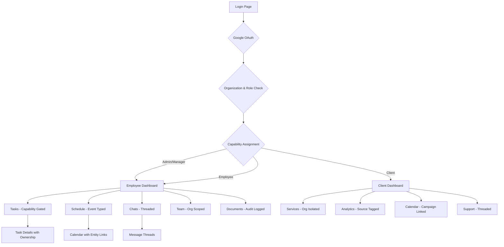

## 1. Product Overview
A comprehensive dashboard system for optimize operations with capability-based access control, supporting multiple organizations, and providing separate interfaces for employees and clients. Employees manage tasks, schedules, and operations while clients access marketing analytics and service performance data.

The system solves operational efficiency by providing granular capability-based permissions, multi-organization support, and role-relevant data access, enabling both internal team coordination and client transparency at scale.

## 2. Core Features

### 2.1 User Roles & Capabilities
| Role | Registration Method | Core Capabilities |
|------|---------------------|-------------------|
| Admin | Google OAuth allowlist | All capabilities: ['*'], organization management, user management, system configuration |
| Manager | Google OAuth allowlist | task.assign, finance.view, client.analytics.read, team.manage, schedule.overview, organization.admin |
| Employee | Google OAuth allowlist | task.self.manage, schedule.self.manage, team.communicate, documents.access, client.view.assigned |
| Client | Google OAuth allowlist | analytics.read.own, services.manage.own, support.create, profile.manage.own |

### 2.2 Multi-Organization Support
- Organizations can have multiple brands and teams
- Users can belong to multiple organizations with different roles
- Client data is isolated by organization
- Cross-organization analytics and reporting capabilities

### 2.3 Feature Module
Our dashboard system consists of the following main pages:

**Employee Dashboard Pages:**
1. **Dashboard**: Overview with tasks list, messages, and schedule widgets with capability-based feature visibility
2. **Tasks**: Full task management with ownership, visibility controls, filtering, and assignments
3. **Schedule**: Calendar view with event types (meeting, campaign, deadline, availability, content_drop) and linked entities
4. **Chats**: Threaded messaging system with task-linked conversations and internal/client visibility controls
5. **Clients**: Client management and overview with organization-based filtering
6. **Team**: Team member directory and collaboration tools with capability-based access
7. **Documents**: File sharing and document management with audit logging
8. **Finance**: Financial overview and reporting with capability-gated access
9. **Settings**: Profile, organization settings, and system preferences

**Client Dashboard Pages:**
1. **Marketing Dashboard**: Overview with service analytics and performance metrics
2. **Services**: Individual service performance tracking (Instagram, Facebook, Pinterest, Email, SMS)
3. **Calendar**: Campaign calendar and scheduling with event type support
4. **Support**: Client support with threaded conversations and ticket management
5. **Settings**: Profile and service configuration

### 2.4 Page Details
| Page Name | Module Name | Feature description |
|-----------|-------------|---------------------|
| Employee Dashboard | Hero Section | Display greeting, current date, task summary with organization context and capability-based actions |
| Employee Dashboard | Quick Actions | Capability-gated action buttons: Refresh, New Task, Help with role-specific options |
| Employee Dashboard | Tasks Widget | Show tasks with ownership (owner_id, primary_assignee_id), visibility controls (private/team/client), filter by capability |
| Employee Dashboard | Messages Widget | Display threaded conversations with unread counts, thread types (dm/task/support/client), visibility filtering |
| Employee Dashboard | Schedule Widget | Calendar with event types and linked entities, capability-based event creation/editing |
| Tasks Page | Task List | Full table with ownership columns, visibility badges, capability-based actions (assign only if task.assign capability) |
| Tasks Page | Task Status | Color-coded badges with owner identification and visibility indicators |
| Tasks Page | Task Actions | Capability-gated actions: edit (task.update.own), delete (task.delete.own), assign (task.assign), status update |
| Schedule Page | Calendar View | Event creation with type selection, entity linking, capability-based visibility controls |
| Schedule Page | Agenda List | Time-based agenda with event type icons, linked entity previews, capability filtering |
| Marketing Dashboard | Analytics Cards | Service metrics with source attribution (api/manual/estimated/imported), rollup indicators |
| Services Page | Service Management | Add/remove services with organization scoping, capability checks |
| Support Page | Threaded Conversations | Create support threads, internal vs client visibility, task linking |
| Settings Page | Organization Management | Multi-organization switching, role management within organizations |

## 3. Core Process

### Employee Flow
1. User authenticates via Google OAuth
2. System determines employee role, capabilities, and active organization
3. Dashboard displays personalized overview with capability-gated widgets
4. User can navigate to specific sections based on their capabilities
5. All actions are capability-restricted and organization-scoped

### Client Flow
1. Client authenticates via Google OAuth with organization allowlist
2. System identifies client role and organization context
3. Dashboard shows organization-specific services and analytics
4. Client can view detailed analytics and manage services within their organization
5. All client data is isolated by organization with audit logging

### Admin/Manager Flow
1. Authenticates via Google OAuth with admin/manager allowlist
2. Accesses enhanced dashboard with organization and team management capabilities
3. Can view cross-organization analytics, assign tasks, manage capabilities
4. Has access to audit logs and system-wide settings

## 4. User Interface Design

### 4.1 Design Style
- **Primary Color**: Blue (#4F7DFF) for active states, buttons, and accents
- **Secondary Colors**: 
  - Success green (#B6F3CC) for completed states
  - Warning red (#F7C9C9) for pending/not started states
  - Organization badge colors for multi-org context
  - Light gray backgrounds for cards and sections
- **Typography**: Rounded sans-serif font family, clean and modern
- **Button Style**: Rounded pills with capability-based visibility, outline for secondary, filled for primary
- **Layout**: Card-based design with soft shadows, rounded corners, and capability-gated sections
- **Icons**: Minimalist line icons with consistent stroke weight, event type icons
- **Spacing**: Generous white space, 8px grid system, organization context indicators

### 4.2 Page Design Overview
| Page Name | Module Name | UI Elements |
|-----------|-------------|-------------|
| Employee Dashboard | Organization Switcher | Dropdown showing active organization, capability-based org management access |
| Employee Dashboard | Capability Badges | Small badges indicating available capabilities, hover for descriptions |
| Employee Dashboard | Task Ownership | Owner avatar, primary assignee highlight, visibility badges (private/team/client) |
| Employee Dashboard | Event Types | Color-coded event type indicators, linked entity previews |
| Employee Dashboard | Thread Indicators | Thread type icons, unread counts, visibility indicators (internal/client) |
| Client Dashboard | Source Attribution | Small badges showing data source (API/Manual/Estimated), rollup indicators |
| Settings Page | Organization Panel | Organization switcher, role within org, capability matrix display |

### 4.3 Responsiveness
- Desktop-first design approach optimized for MacBook Pro 14"-2 screen size
- Responsive grid system adapting to tablet and mobile
- Sidebar collapses to icons-only on smaller screens
- Cards stack vertically on mobile devices
- Touch-optimized interactions for mobile users
- Organization context maintained across screen sizes

### 4.4 Event Bus Architecture
- Central command dispatcher for all state changes
- Optimistic UI updates with rollback capability
- Real-time synchronization across clients
- Capability-gated event subscriptions
- Audit logging for all state changes

## 5. Content Management with Sanity CMS

### 5.1 Managed Content Types
- Dashboard copy and empty states
- Client onboarding text and workflows
- Email templates and support macros
- Help articles and documentation
- Service configuration templates
- Organization-specific messaging

### 5.2 A/B Testing Support
- Variant content for different user segments
- Capability-based content delivery
- Organization-specific content variations
- Analytics integration for content performance